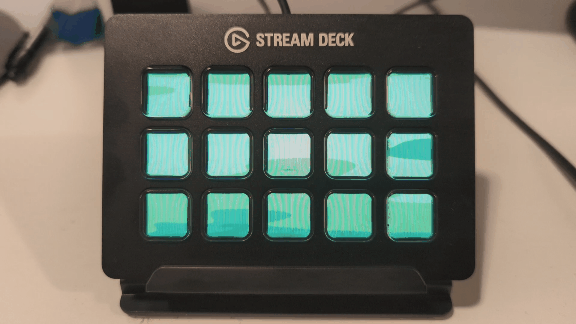

# Whack-An-Ernst

## ℹ️ Description

Whack-An-Ernst is a "Whack-A-Mole"-inspired game for the Elgato Stream Deck.



[](https://github.com/hagronnestad/streamdeck-whack-an-ernst/actions/workflows/dotnet.yml)


- [Whack-An-Ernst](#whack-an-ernst)
  - [ℹ️ Description](#ℹ️-description)
  - [💡 Origin](#-origin)
  - [💾 Download & Try](#-download--try)
  - [🕹️ How To Play](#️-how-to-play)
  - [🐧 Linux Support & Troubleshooting](#-linux-support--troubleshooting)
    - [Stream Deck HID Device Permission](#stream-deck-hid-device-permission)
    - [Sound Issues](#sound-issues)


## 💡 Origin

When you get new toys you have to play with them... [StreamDeckSharp
](https://github.com/OpenMacroBoard/StreamDeckSharp) makes it really easy to make custom software for the Stream Deck.


## 💾 Download & Try

- Download a [release build here](releases)
  - (or clone the repo and build from source)
- Exit the Stream Deck application
- Run Whack-An-Ernst
- Play
- Exit Whack-An-Ernst
- Restart the Stream Deck application


## 🕹️ How To Play

- Whack Ernst over the head with a club. Press the button showing Ernst popping out of his hole to hit him with the club.
- Be quick! Ernst can hide pretty fast. The quicker you hit Ernst the more points you score!
- Don't press any empty buttons or holes with no Ernst in them or else your score will take a hit too!

---

## 🐧 Linux Support & Troubleshooting

The game has been tested on Ubuntu 22.04. You might get lucky on other x64 Linux systems. Some troubleshooting tips added below.

### Stream Deck HID Device Permission

You might get a permission issue on the Stream Deck HID device. It will look something like this.

```
HidSharp.Exceptions.DeviceUnauthorizedAccessException: Not permitted to open HID class device at /dev/hidraw1.
```

Use the following command to take ownership of the HID device. Replace `{your_user_name}` with your user name, without the curly braces.

```bash
$ sudo chown {your_user_name}:{your_user_name} /dev/hidraw1
```

### Sound Issues

Sound might not work if you run the game using `sudo`. You might get an error message looking like this.

```bash
ALSA lib pcm_dmix.c:1032:(snd_pcm_dmix_open) unable to open slave
```